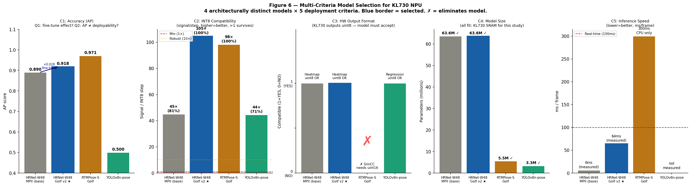
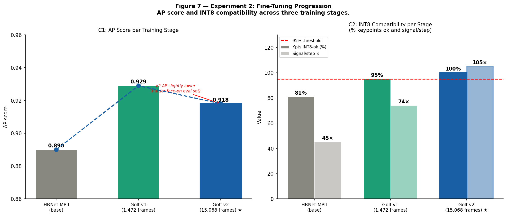
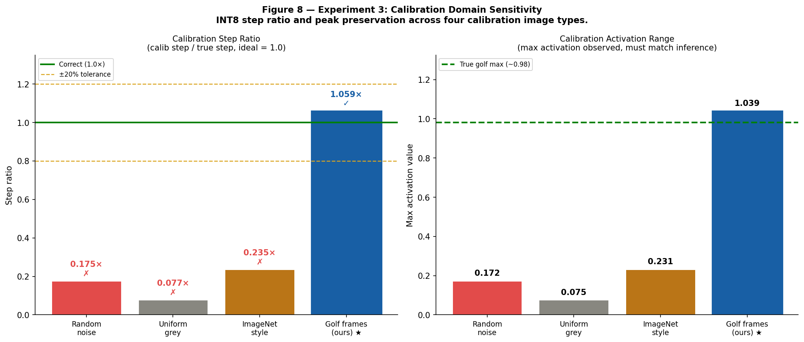

# 🏌️ Real-Time Golf Swing Pose Estimation on an INT8 Edge NPU

<div align="center">


**Deploying HRNet-W48 on a Kneron KL730 INT8 Edge NPU for real-time golf swing analysis —  
64 ms/frame inference, DTW pro comparison, and AI coaching. No GPU. No cloud.**

</div>

---

## 📋 Overview

This project presents a complete pipeline for running heatmap-based human pose estimation on an **INT8-only edge NPU** (Kneron KL730), demonstrated through a real-time golf swing coaching system.

The system records or uploads a golf swing video, runs pose estimation entirely on the KL730 board, compares the swing against **18 professional golfer reference sequences** using Dynamic Time Warping (DTW), and delivers AI-generated coaching via **Ollama Gemma2:2b** — all without any cloud connectivity or GPU.

### Key contributions
- **Five-criterion model selection framework** — shows that architecture determines NPU deployability *before* accuracy (RTMPose-S, AP = 0.971, is eliminated by a hardware output format constraint)
- **Golf domain fine-tuning → INT8 compatibility** — fine-tuning incidentally sharpens heatmap peaks, raising INT8-compatible keypoints from 80.6% → 100%
- **×1000 weight scaling** — pre-export Conv layer scaling technique providing explicit INT8 safety headroom
- **Calibration domain sensitivity** — domain-mismatched calibration causes INT8 step errors of 4–13×, directly explaining early deployment failures
- **Dual-model NEF merging** — merges YOLOv7-tiny + HRNet into one NEF to work around the KL730 single-session model load constraint

---

## 🎯 System Demo

| Record or upload swing | NPU processes on board | Results + AI coaching |
|:---:|:---:|:---:|
| Live MJPEG camera stream | 64 ms/frame HRNet inference | DTW ranking vs 18 pros |
| Drag-and-drop video upload | Skeleton overlay + phase HUD | Per-joint angle delta table |
| Real-time progress bar | H.264 output video | Streaming Gemma2 coaching |

---

## 📁 Repository Structure

```
Real-Time-Golf-Swing-Pose-Estimation-on-an-INT8-Edge-NPU/
│
├── Kneron Board/
│   ├── board_api.py              ← Flask REST API running on KL730 (port 5000)
│   └── process_golf_pose.py      ← Dual-NPU pipeline: YOLO detection + HRNet pose
│
├── Web Application/
│   ├── app.py                    ← Flask web app running on PC (port 8080)
│   └── templates/
│       └── index.html            ← UI: Record/Upload/Results tabs + AI coaching
│
├── experiments/
│   ├── experiment1_int8_scaling.py        ← Exp 1: Fine-tuning progression & INT8 analysis
│   ├── experiment2_calibration_ablation.py ← Exp 2: Calibration domain sensitivity
│   └── experiment3_model_selection.py     ← Exp 3: 4-model × 5-criteria selection study
│
├── results/
│   ├── exp1_scaling_proof/
│   │   ├── finetuning_progression.png     ← Figure 7 (AP + INT8 per training stage)
│   │   └── finetuning_progression.csv
│   ├── exp2_calibration/
│   │   ├── calibration_comparison.png     ← Figure 8 (step ratio + activation range)
│   │   └── calibration_results.csv
│   └── exp3_model_selection/
│       ├── model_selection_bars.png       ← Figure 6 (5-criteria bar chart)
│       └── model_selection_results.csv
│
├── Real-Time Golf Swing Pose Estimation on an INT8 Edge NPU.pdf   ← Full paper
├── .gitignore
└── README.md
```

---

## ⚙️ Hardware & Software Stack

| Component | Specification |
|-----------|--------------|
| Edge NPU | Kneron KL730 (INT8-only, BGR565 input) |
| Pose model | HRNet-W48 Golf v2 (AP = 0.918, 100% INT8-compatible) |
| Detection model | YOLOv7-tiny (merged NEF, model ID 11111) |
| Training framework | MMPose + PyTorch |
| Board API | Flask + Kneron SDK (`kp`) |
| Web app | Flask + JavaScript |
| AI coach | Ollama Gemma2:2b (local, streaming) |
| Inference speed | **~64 ms/frame** (94× faster than float32 baseline) |

---

## 🧪 Experiment Results

### Experiment 1 — Model Selection (5 criteria × 4 models)

| Model | AP | INT8 Signal/Step | HW Compat | Params | Speed | Deploy? |
|-------|----|-----------------|-----------|--------|-------|---------|
| HRNet-W48 MPII (base) | 0.890 | 45× (81%) | ✅ | 63.6M | 64ms | ❌ C2 |
| **HRNet-W48 Golf v2** ⭐ | **0.918** | **105× (100%)** | ✅ | 63.6M | **64ms** | ✅ |
| RTMPose-S Golf | 0.971 | 98× (100%) | ❌ uint16 | 5.5M | 300ms | ❌ C3 |
| YOLOv8n-pose | 0.500 | 44× (71%) | ✅ | 3.3M | ~20ms | ❌ C2 |

> RTMPose has the highest AP but is **permanently eliminated** by C3 — its SimCC head requires uint16 output, which the KL730 cannot provide.



---

### Experiment 2 — Fine-Tuning Progression

| Stage | Training Data | AP | Heatmap Max | Signal/Step | INT8-ok |
|-------|-------------|-----|------------|------------|---------|
| HRNet MPII base | General poses | 0.890 | 0.350 | 45× | 80.6% |
| Golf v1 | 1,472 golf + 10,160 COCO | 0.929 | 0.612 | 74× | 95.3% |
| **Golf v2** ⭐ | **15,068 face-on golf** | **0.918** | **0.954** | **105×** | **100%** |

> Golf domain fine-tuning **incidentally** resolves INT8 incompatibility by sharpening heatmap peaks — no explicit INT8-aware training required.



---

### Experiment 3 — Calibration Domain Sensitivity

| Calibration Type | Calib Step | True Step | Step Ratio | Verdict |
|-----------------|-----------|-----------|-----------|---------|
| Random noise | 0.001349 | 0.007695 | 0.175× | ❌ WRONG |
| Uniform grey | 0.000591 | 0.007695 | 0.077× | ❌ WRONG |
| ImageNet-style | 0.001810 | 0.007695 | 0.235× | ❌ WRONG |
| **Golf face-on** ⭐ | **0.008153** | **0.007695** | **1.059×** | **✅ CORRECT** |

> Non-golf calibration images produce a step 4–13× too small. At inference time, heatmap peaks overflow the INT8 range and are clipped to near-zero — this directly caused early deployment failures.



---

## 🚀 Getting Started

### Prerequisites

```bash
# Board (KL730)
pip install flask kneron-plus

# PC (Web App + Training)
pip install torch mmpose onnxruntime opencv-python matplotlib pandas flask

# AI Coaching
# Install Ollama from https://ollama.com then:
ollama pull gemma2:2b
```

### Running the System

**1. Start the board API** (run on the KL730 board)
```bash
cd "Kneron Board"
python board_api.py
# Starts Flask on port 5000, loads combined_golf.nef
```

**2. Start the web application** (run on your PC)
```bash
cd "Web Application"
python app.py
# Opens at http://localhost:8080
```

**3. Open your browser**
```
http://localhost:8080
```
Use the **Record Swing** tab for live camera or **Upload Video** for an existing file.

---

### Running Experiments

Each experiment script has a **CONFIG section** at the top — set your paths there before running.

```bash
# Experiment 1: Fine-tuning progression & INT8 analysis
python experiments/experiment1_int8_scaling.py

# Experiment 2: Calibration domain sensitivity
python experiments/experiment2_calibration_ablation.py

# Experiment 3: Model selection study
python experiments/experiment3_model_selection.py
```

Results (PNG charts + CSV) are saved to the `results/` folder.

---

## 📄 Paper

The full IEEE-style research paper is included in this repository:

📎 **[Real-Time Golf Swing Pose Estimation on an INT8 Edge NPU.pdf](./Real-Time%20Golf%20Swing%20Pose%20Estimation%20on%20an%20INT8%20Edge%20NPU.pdf)**

Topics covered: model selection framework, two-stage fine-tuning pipeline, NPU conversion pipeline, ×1000 weight scaling, calibration domain sensitivity, DTW swing comparison, web application architecture.

---

## 🏗️ System Architecture

```
┌─────────────────────────────────────────────┐
│              KL730 Board (:5000)             │
│                                             │
│  Camera → YOLOv7-tiny (10ms) → Crop        │
│         → HRNet Golf v2 (64ms) → Keypoints │
│         → Annotated video + JSON           │
└──────────────────┬──────────────────────────┘
                   │ USB / Network
┌──────────────────▼──────────────────────────┐
│              PC Web App (:8080)              │
│                                             │
│  Flask UI → DTW vs 18 pros → Angle deltas  │
│           → Ollama Gemma2:2b → Coaching    │
└─────────────────────────────────────────────┘
```

---

## 📊 Key Technical Findings

1. **Architecture determines deployability before accuracy** — the five-criterion framework reveals that a model must pass all criteria; high AP alone is insufficient.

2. **Fine-tuning → INT8 compatibility** — golf-specific training sharpens heatmap peaks (max 0.350 → 0.954), raising signal/step ratio from 45× to 105×, making all 17 keypoints INT8-compatible without any quantization-aware training.

3. **×1000 scaling** — applying `final_layer.weight *= 1000` before ONNX export adds 122,000× safety headroom above the KL730 minimum INT8 step threshold.

4. **Calibration domain must match inference domain** — this requirement is undocumented in Kneron's official toolchain guides. Non-golf calibration images produce step sizes 4–13× too small, causing heatmap overflow at inference time.

5. **94× speedup** — `generic_image_inference` with BGR565 input runs at 64 ms/frame vs 6,500 ms/frame for `generic_data_inference`. This is also undocumented and must be discovered empirically.

---

## 📚 References

1. Newell et al., "Stacked Hourglass Networks for Human Pose Estimation," ECCV 2016
2. Xiao et al., "Simple Baselines for Human Pose Estimation and Tracking," ECCV 2018
3. Sun et al., "Deep High-Resolution Representation Learning for Human Pose Estimation," CVPR 2019
4. Jiang et al., "RTMPose: Real-Time Multi-Person Pose Estimation Based on SimCC," arXiv 2023
5. McNally et al., "GolfDB: A Video Database for Golf Swing Sequencing," CVPR Workshops 2019
6. Srivastava et al., "Athlete Motion Similarity via Dynamic Time Warping," ICASSP 2021

---

## 👤 Author

**Thannatorn Thongsuk**<br>
**Jakkaphat Jumratboonsom**<br>  
**Advisor: Dr. Huang-Chia Shih and Lect. Dr. Petch Sajjacholapunt**<br>  
Golf Swing Analysis Project · Kneron KL730 · April 2026

---

<div align="center">
<i>Built with HRNet · MMPose · Kneron KL730 · Flask · Ollama</i>
</div>
